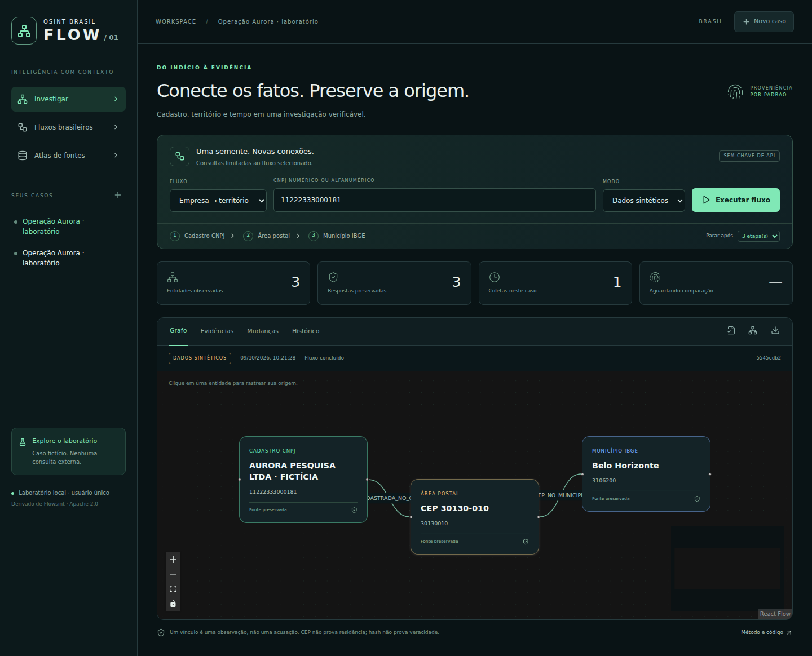

<div align="center">

# OSINT Brasil Flow
### Conecte os fatos. Preserve a origem.

**Uma evolução brasileira do [Flowsint](https://github.com/reconurge/flowsint): grafos, fluxos e investigação verificável.**

[](https://github.com/Ridd1kulusC0d3r/OsintbrFLOW/actions/workflows/brasil.yml)


[Começar](#começar-em-modo-laboratório) · [Arquitetura](docs/brasil/ARCHITECTURE.md) · [Pesquisa comparativa](docs/brasil/RESEARCH.md) · [Roadmap](docs/brasil/ROADMAP.md) · [Validação](docs/brasil/VALIDATION.md)

</div>



## O que é

Um fork funcional do Flowsint, baseado no commit `4c05849bc6ca5055ad187d056ef26e61b3bc2fea`, com uma camada brasileira implementada. Preserva os módulos, o editor visual de fluxos, os enriquecedores, a autenticação, os sketches e o grafo Neo4j do upstream. Acrescenta um workspace em português para transformar uma consulta em uma sequência de observações rastreáveis.

**A versão 0.1.0 é uma alpha de investigação empresarial e territorial.** Não há base para afirmar superioridade geral ao Flowsint: ainda faltam benchmarks, validação multiusuário e mais conectores. Os diferenciais abaixo são verificáveis no código e nos testes.

## O que já funciona

| Capacidade | Entrega |
|---|---|
| Tipos brasileiros nativos | `BrazilCompany`, `BrazilCEP`, `BrazilMunicipality`; identificação por chave, não por nome |
| CNPJ numérico e alfanumérico | Normalização e cálculo de DV seguindo a especificação da Receita |
| Três APIs reais | BrasilAPI CNPJ, ViaCEP e IBGE Localidades; sem chave |
| Percursos brasileiros | Empresa → CEP → município; cadastro; CEP → município; município |
| Enriquecedores no editor Flowsint | `br_cnpj_lookup`, `br_company_to_cep`, `br_cep_to_municipality` |
| Casos persistentes | Finalidade, histórico e coletas em SQLite; API nativa separa casos por usuário |
| Proveniência | URL, horário UTC, versão do conector, corpo JSON recebido e SHA-256 |
| Mudanças explicáveis | Diferenças campo a campo entre coletas completas da mesma semente, modo e percurso |
| Integridade exportável | Pacote JSON com hashes encadeados; verificador independente pela CLI |
| Ponte com grafo nativo | Exporta JSON tipado; importador Flowsint preserva propriedades e referência de evidência |
| Atlas brasileiro | 1.171 entradas: 3 conectores e 1.168 referências HTTPS deduplicadas do OSINT Brazuca |
| Laboratório sintético | Caso fictício sem chamadas externas; nunca apresentado como resultado real |

O atlas **não significa 1.171 integrações**. Fontes manuais estão rotuladas; sua disponibilidade não foi testada individualmente. Uma resposta 404, timeout ou falha de fonte nunca gera uma conclusão de inexistência.

## Começar em modo laboratório

### Docker — caminho mais curto

```bash
git clone https://github.com/Ridd1kulusC0d3r/OsintbrFLOW.git
cd OsintbrFLOW
docker compose -f compose.lab.yml up --build
```

Abra **http://localhost:8000/brasil.html**. Os casos ficam no volume `brasil_data`. O laboratório é de usuário único e só é publicado em `127.0.0.1`. Não o exponha à internet. O arquivo Compose foi revisado, mas Docker não estava disponível no ambiente de validação desta entrega.

### Python + Node — caminho executado na validação

Requisitos: Python 3.12+, Node 24 e npm.

```bash
python -m venv .venv
# Linux/macOS:
source .venv/bin/activate
# Windows PowerShell, use: .venv\Scripts\Activate.ps1
pip install -r requirements-brasil.txt
npm ci --ignore-scripts --legacy-peer-deps
npm run build --workspace flowsint-app
python scripts/brasil.py
```

Abra **http://localhost:8000/brasil.html**.

1. Clique em **Explorar caso demonstrativo** para percorrer a investigação fictícia.
2. Clique em uma entidade para examinar propriedades e origem.
3. Execute novamente o mesmo fluxo e abra **Mudanças**.
4. Em **Novo caso**, defina nome e finalidade. Selecione **Fontes reais** e informe o identificador.
5. Exporte o pacote de evidências ou o grafo pelo cabeçalho do painel.

O identificador `11222333000181` é usado exclusivamente como fixture sintática no modo demonstrativo. O nome empresarial exibido é inventado; não o use para alegar fatos sobre uma organização real.

## Rodar o fork completo do Flowsint

```bash
python scripts/init-brasil.py
docker compose -f compose.br.yml up --build -d
```

Abra **http://localhost:5173/register**, crie sua conta e acesse **Brasil Flow** na barra lateral, ou `/dashboard/brasil`. `init-brasil.py` gera segredos aleatórios sem sobrescrever uma configuração existente.

O Compose BR **compila este repositório**, em vez de baixar imagens upstream que não contêm as alterações brasileiras. Inclui PostgreSQL, Neo4j, Redis, API, worker e frontend. O socket Docker do host não é montado por padrão: enriquecedores upstream que lançam ferramentas em containers exigem configuração adicional consciente; os conectores brasileiros não dependem dele.

O modo completo ainda precisa de um teste de implantação de ponta a ponta com esses serviços reais. A compilação do frontend, a lógica dos enriquecedores e a importação de grafo foram testadas separadamente.

### Percurso no editor de fluxos nativo

Crie uma entidade **BrazilCompany**, forneça `cnpj`, conecte:


O painel Brasil tem seu próprio histórico de evidências. Os sketches nativos continuam no Neo4j. A passagem entre ambos é **explícita**, pelo botão de exportar grafo e a importação JSON na investigação nativa. Não há sincronização bidirecional automática nem auditoria retroativa dos enriquecedores upstream.

## O que esta versão não faz

- Não automatiza todos os links do catálogo, nem PNCP, TSE, CEIS/CNEP, CVM ou DataJud.
- Não infere culpa, identidade de pessoas por homônimos ou residência por CEP.
- Não contém pontuação de risco artificial nem conclusões geradas por LLM.
- Não possui agendamento de coleta, colaboração em tempo real, RBAC granular ou armazenamento WORM.
- Não demonstra cadeia de custódia jurídica: hashes identificam alterações no pacote; não autenticam a fonte nem impedem reescrita por quem controla todo o armazenamento.
- Não roda o backend no GitHub Pages.
- Não traduz toda a interface herdada. O workspace Brasil está em português.

## Testes e verificação

```bash
pip install pytest pytest-asyncio
# Linux/macOS — camada portátil:
PYTHONPATH=flowsint-types/src:flowsint-core/src pytest tests/brasil/test_brasil.py -q
npm run typecheck:brasil --workspace flowsint-app
npm run build --workspace flowsint-app
python scripts/verify-bundle.py seu-pacote.json
```

O teste de integração nativa em `tests/brasil/test_native.py` exige as dependências herdadas do core e acrescenta `flowsint-enrichers/src` ao `PYTHONPATH`. Consulte [VALIDATION.md](docs/brasil/VALIDATION.md) para resultados, limitações e dívida técnica upstream. O `typecheck` global herdado ainda não passa; a checagem específica Brasil passa.

## Referências e créditos

- **Flowsint / Reconurge**: base de código preservada, Apache-2.0. [README original](docs/brasil/UPSTREAM-README.md), [LICENSE](LICENSE), [NOTICE](NOTICE).
- **OSINT Brazuca**: catálogo adaptado com deduplicação HTTPS, licença MIT preservada em [LICENSE-osint-brazuca.txt](docs/brasil/LICENSE-osint-brazuca.txt).
- **SpiderFoot**: referência para processamento orientado a eventos e limites de propagação; código não copiado.
- **OSIRIS**: referência para contexto espacial e apresentação da disponibilidade das fontes; código não copiado.
- **OSINT Brasil, de Juan Mathews Rebello Santos**: referência de catálogo, filtros, favoritos e descoberta. Sem licença de redistribuição confirmada, conteúdo não copiado.

[Análise técnica com commits e arquivos consultados →](docs/brasil/RESEARCH.md)
