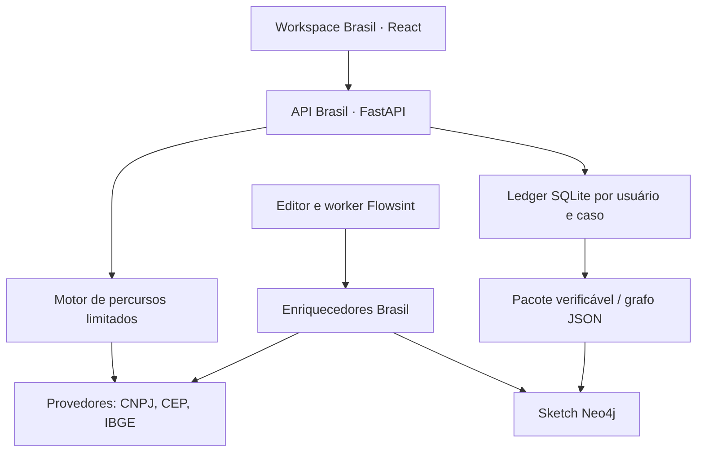

# Arquitetura — alpha 0.1.0

## Decisão: evoluir o Flowsint preservando a base

Os cinco pacotes herdados permanecem no repositório. O módulo Python `osintbr` vive no pacote `flowsint-core`, mas não importa o `__init__` do core: isso permite rodar o laboratório sem PostgreSQL, Redis e Neo4j. O mesmo Provider é usado pelo painel e pelos enriquecedores nativos.

## Identidade e observações

- CNPJ de 14 posições, incluindo o novo formato alfanumérico, é a chave da empresa. Estabelecimentos com raízes iguais não são unidos automaticamente.
- CEP é chave postal. Município usa código IBGE de sete dígitos. Strings de sete dígitos não são detectadas automaticamente para evitar ambiguidades.
- O detector verifica CNPJ e CEP formatado antes dos detectores genéricos.
- Nomes não são chaves de resolução de identidade. Não são criados nós de pessoas a partir do QSA.
- Arestas carregam uma referência da evidência de origem. A semântica é `source_statement`, não inferência.

## Coleta e persistência

Endpoints e hosts dos conectores são fixos. Entradas são normalizadas antes de compor caminhos. Redirecionamentos não são seguidos. Limite de 2 MB por resposta, timeout HTTP de 15 segundos, até duas tentativas para 429/5xx. Quatro execuções simultâneas por processo de API, até três etapas sequenciais por execução. Não há cache compartilhado que possa apresentar dados antigos como uma nova coleta.

O corpo JSON UTF-8, após decodificação HTTP, é preservado e hasheado; não é uma captura de tráfego ou dos bytes TLS. A versão do conector e `retrieved_at` UTC são registrados. Horário de coleta não é a data de atualização da base: a resposta pode refletir dados antigos.

SQLite usa WAL, chaves estrangeiras, conexão por operação e `BEGIN IMMEDIATE` para serializar o append. Cada run contém `previous_hash` e `chain_hash`. A transação escolhe uma baseline completa com a mesma semente, modo e sequência de etapas. Coletas parciais não geram diferenças de remoção.

O banco Brasil é separado do PostgreSQL/Neo4j. A tabela `cases.owner` usa o UUID autenticado do Flowsint. Todos os endpoints de caso verificam essa relação. O laboratório usa um owner fixo, escuta localhost no launcher e bloqueia hosts/origens externos; não oferece autenticação multiusuário.

O pacote inclui metadados do caso, todas as execuções ordenadas e checksum geral. O verificador testa checksum, encadeamento, SHA do conteúdo, JSON versus conteúdo preservado e grafo versus evidências. Um atacante com capacidade de reconstruir o pacote e todos os hashes pode produzir outro pacote válido. Ancoragem externa e assinatura estão no roadmap.

## Integração nativa e isolamento

`br_cnpj_lookup`: BrazilCompany → BrazilCompany; consulta BrasilAPI e atualiza o nó pelo identificador.

`br_company_to_cep`: BrazilCompany → BrazilCEP; deriva o CEP observado no cadastro. Sem consulta adicional.

`br_cep_to_municipality`: BrazilCEP → BrazilMunicipality; consulta ViaCEP, usa o código IBGE retornado e consulta o município.

Enriquecedores nativos registram metadados de proveniência nos nós, mas não usam o ledger do painel. Para preservar o corpo integral e histórico encadeado, execute pelo workspace Brasil. A exportação para o Flowsint contém tipos e `nodeProperties`; o importador foi corrigido para não descartar esses campos ao reconstruir entidades pelo label.

## Limitações operacionais

Não há fila durável para os percursos do painel: são requisições aguardadas pela API. Se o processo cair antes do append, a execução não será preservada. Para implantação em equipe: implementar fila persistente, controles de retenção/eliminação, backups consistentes, quotas por usuário, políticas de acesso e benchmark. O uso dos dados públicos precisa ser compatível com a finalidade do caso; este documento não oferece parecer jurídico.
